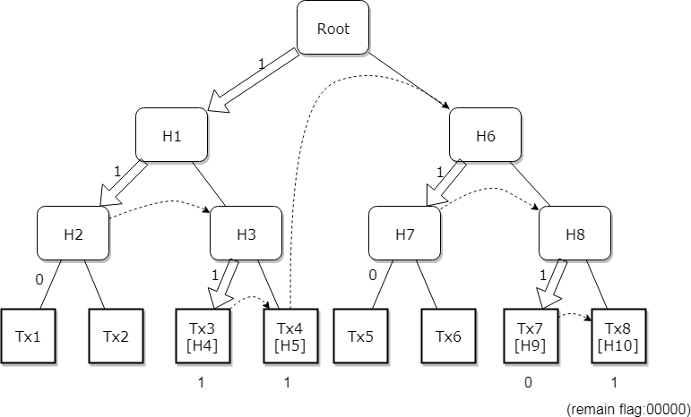

# 第6回 exercise

回答法：
S=送信者  R=受信者  コロンの後にメッセージ名
カンマで区切って下さい　繰り返しのやり取りは{ }で囲う

例： {S:ping,R:pong} = S:ping,R:pong,S:ping,R:pong...

前提：送信者は原始ブロックしか持っていない。あるノードのIPアドレスを知った。

## submit

<https://docs.google.com/forms/d/e/1FAIpQLScoAc1_okqEU2xT7em8okJMQRM4Qre1an4I1OXDg_XPW6bsdQ/viewform>

### common reference

- Mastering Bitcoin Open Edition in Japanese

    <https://www.bitcoinbook.info/translations/ja/book.pdf>

## 1. 同期するまでのメッセージ

ノード(受信者)とどのメッセージのやり取りをすれば同期できるのか

`S:version, R:verack, R:version, S:verack,
{S:getblocks, R:inv, S:getdata, R:block}`

### reference

- Bitcoin wiki

    <https://en.bitcoin.it/wiki/Version_Handshake>

- Mastering Blockchain : Figure 4. ピア同士の最初のハンドシェイク ~, SPV Figure 6. ピアからブロックを取得することによってブロックチェーンと同期するノード

## 2. SPVモードで自分のウォレットと関係ある取引だけ同期したい場合の同期法

`S:version,R:verack,R:version,S:verack,S:getheaders,R:headers,S:filterload,{S:getblocks,R:inv,S:getdata,R:merkleblock,R:tx}`

- solution:

  - invを取得する必要な情報を取捨選択するために一旦header情報のみ取得 -> getheaders
  
  - Mastering Blockchain "Bloom Filters and Inventory Updates"の節によると、SPVで使用されるBloom Filter送信時の順序性は以下の通り

    ```C
    S:filterload`
    この後に
    S:getdata,R:merkleblock,R:tx
    ```

### reference

- Mastering Blockchain - above

- filterload, filteradd, filterclear, merkleblock - Bitcoin wiki
    <https://en.bitcoin.it/wiki/Protocol_documentation#filterload.2C_filteradd.2C_filterclear.2C_merkleblock>

## 3. 8個の取引のあるブロックのmerkleblockメッセージに含まれたフラグバイトは 0xDEA0 で2バイトです。左から1-8の番号振った場合、どの取引がマッチしたか。    回答例：1,5,7,8

`3,4,8`

- solution

1. bit array : 0xDEA0 = b'1101 1110 1010 0000'

    e.g. use bit conversion <https://note.cman.jp/convert/bit/> (16bit)

2. parse MerkleBlock as flag '1101 1110 1010 0000', Tx count:8 as below image

    

3. result : Tx3:1, Tx4:1, Tx8:1 (remain flag '0 0000')

### reference

- Parsing A MerkleBlock - developer examples

<https://bitcoin.org/en/developer-examples#parsing-a-merkleblock>

    - e.g. flag:10111000, Tx count:8

[source]: <https://bitcoin.org/img/dev/animated-en-merkleblock-parsing.gif>
